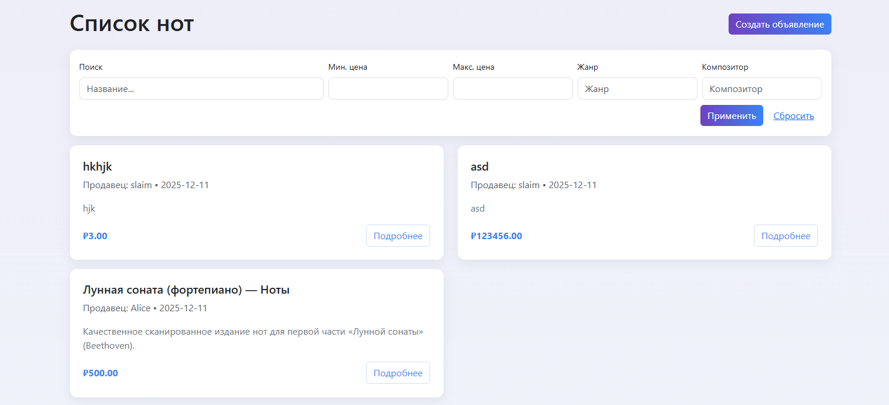
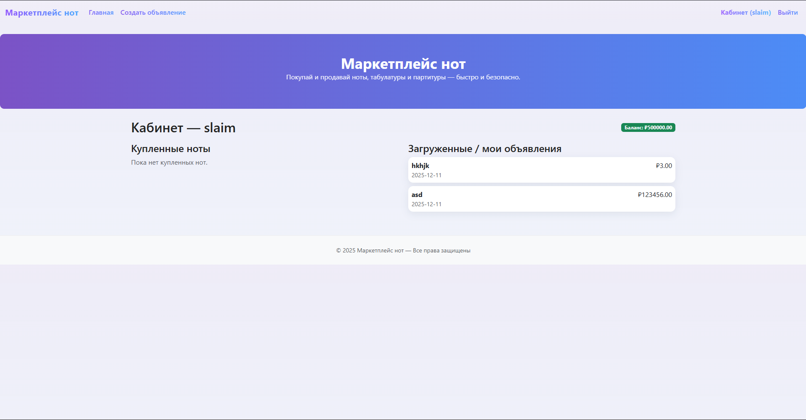
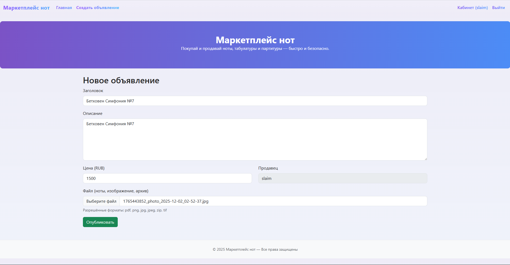
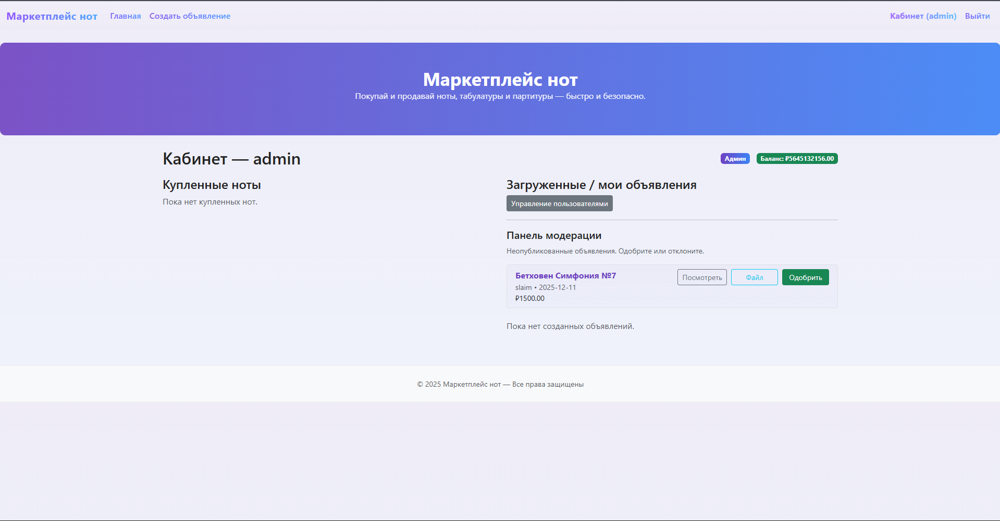
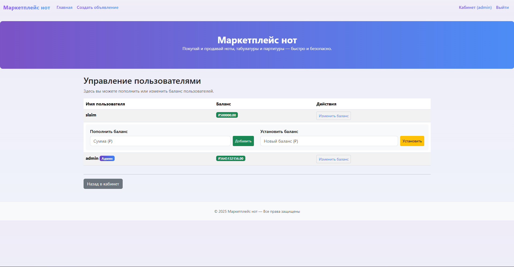

## Актуальность темы
В современном мире цифровизация коснулась всех сфер жизни, включая музыкальное образование. Музыканты, преподаватели и студенты всё чаще предпочитают цифровые ноты бумажным изданиям. Однако существующие платформы имеют ряд недостатков:
Высокие комиссии для продавцов
Сложные интерфейсы
Отсутствие специализации на нотах
Неудобные системы оплаты
Разработанный маркетплейс решает эти проблемы, предоставляя удобную платформу для покупки и продажи нот, табулатур и партитур.
##  Цель работы
Создать полнофункциональный веб-приложение для торговли музыкальными нотами с системами
## Стек технологий
**Фронтенд:**
- HTML5 + CSS3 (Взял его потому что работал уже с ним. В целом со всем остальным такая же ситуация)
- JavaScript 
- bootstrapcss

**Бэкенд:**
- Python 3.11
- Flask (микрофреймворк)
- Flask-SQLAlchemy (ORM)
- Flask-Login (аутентификация)
- Flask-WTF (формы)

**База данных:**
- PostgreSQL

**Инфраструктура:**
- Docker + Docker Compose

## Дизайн сайта
Шапка сайта:

Логотип/название "Маркетплейс нот" слева
Мобильное меню (гамбургер) справа
При нажатии открываются: "Создать объявление" и "Кабинет (admin) Выйти"

Маркетплейс нот
Покупка и продажа нот, табулатур и партитур — быстро и безопасно.
Система фильтров:

Логотип "Маркетплейс нот"
Слоган: "Покупай и продавай ноты, табультуры и партитуры — быстро и безопасно"

### Название нот
Карточки товаров
Каждая карточка содержит:
Полная версия главной страницы:
Фильтры поиска:
Поле "Название..."
Минимальная цена
Максимальная цена
Выбор жанра
Выбор композитора
Кнопки "Применить" и "Сбросить"
Список объявлений:
"hjk" от slaim (цена: P3.00)
"Лунная соната (фортепиано)" от Alice (цена: P500.00)
"asd" от slaim (цена: P123456.00)
У каждого: продавец, дата, описание, кнопка "Подробнее"

### Вест сайт целеком

### Панель пользователя
Заголовок: "Кабинет — slaim"
Раздел "Купленные ноты" - пусто ("Пока нет купленных нот")
Раздел "Загруженные / мои объявления":
И количество денег на балансе

### Создание объвлений
Основные поля:
Заголовок (пример: "Бетховен Симфония №7")
Описание
Цена (в RUB, пример: 1500)
Продавец (автоматически: slaim)
Загрузка файла:
Кнопка "Выберите файл"
Поддерживаемые форматы: pdf, eps, jpg, jpeg, png, gif, tiff

### Меню карточки товара
Страница конкретного нотного издания:
Заголовок: "Бетховен Симфония №7"
Продавец: admin + дата
Описание
Цена: P1500.00
Блок покупки:
Поле "Ваше имя" / "Имя покупателя"
Кнопка "Купить"
Блок файла:
Информация о возможности скачать файл
Кнопка "Скачать файл" (доступна только продавцу или тому кто купил)

### Панель Администратора
Панель модерации:
Заголовок: "Неопубликованные объявления. Одобряйте или отклоняйте"
Пример объявления: "Бетховен Симфония №7" от admin
Кнопки: "Посмотреть", "Одобрить",
Управление пользователями

### Панель пополнения счета других пользователей
Описание: "Здесь вы можете пополнить или изменить баланс пользователей"
Таблица пользователей:
slaim: баланс (скрыто звездочками), кнопка "Изменить баланс"
admin: баланс (скрыто), кнопка "Изменить баланс"
Формы управления:
"Пополнить баланс" - поле "Сумма (Р)" + кнопка "Добавить"
"Установить баланс" - поле "Новый баланс (Р)" + кнопка "Установить"

Алгоритм покупки товара (Бизнес Логика):

1. Пользователь открывает страницу объявления.
2. При нажатии кнопки "Купить":
   а) Проверяется, авторизован ли пользователь.
   б) Проверяется, достаточно ли денег на балансе.
   в) Если достаточно — создаётся запись в таблице Purchase.
   г) Баланс покупателя уменьшается, баланс продавца увеличивается.
   д) Покупателю показывается страница с подтверждением покупки.
3. Если денег не хватает — показывается сообщение об ошибке.

Алгоритм добавления объявления:

1. Пользователь нажимает "Добавить объявление".
2. Проверяется, вошёл ли пользователь в систему.
3. Из формы берутся данные: название, цена, файл.
4. Проверяется формат файла.
5. Объявление сохраняется в БД
6. Администратор должен одобрить объявление.

Алгоритм авторизации пользователя:

1. Пользователь вводит логин и пароль.
2. В БД ищется пользователь с таким логином.
3. Проверяется хеш пароля (check_password_hash).
4. Если совпадает — пользователь входит в систему (login_user()).
5. Иначе — сообщение об ошибке.

Макет сайта
🔹 1. Верхняя часть страницы — навигационная панель (меню)

В самом верху страницы расположен блок навигации (nav).
Он содержит:

название сайта «Маркетплейс нот», которое одновременно является ссылкой на главную страницу;

пункты меню: «Главная» и «Создать объявление»;

справа находятся ссылки для авторизации:

если пользователь не вошёл в систему, показываются «Вход» и «Регистрация»;

если пользователь авторизован, отображаются «Кабинет (имя пользователя)» и «Выход».

Навигационная панель выполнена с помощью классов Bootstrap (navbar, navbar-expand-lg, navbar-dark, bg-gradient) и автоматически перестраивается под размер экрана.
На мобильных устройствах меню сворачивается в кнопку-гамбургер.

🔹 2. Заголовок сайта (герой-блок)

Под навигационной панелью находится крупный герой-блок (header class="hero").
В нём размещаются:

большой заголовок: «Маркетплейс нот»;

подзаголовок: «Покупай и продавай ноты, табулатуры и партитуры — быстро и безопасно.»

Этот блок визуально отделяет шапку сайта от основного содержимого, создаёт первое впечатление и задаёт стиль ресурса.
Текст расположен по центру и имеет белый цвет на фоне градиента.

🔹 3. Основная часть страницы — контейнер с содержимым

Далее расположен основной контейнер (div class="container").
Он отвечает за размещение основного содержимого страницы.
Контейнер центрирует элементы и создаёт одинаковые отступы по бокам.

Внутри него находятся:

Системные уведомления (alerts) — всплывающие сообщения, которые информируют пользователя о действиях на сайте (например: «Регистрация успешна», «Ошибка входа»).
Эти уведомления автоматически исчезают через несколько секунд благодаря скрипту main.js.

Основной контент () — сюда подставляется содержимое конкретных страниц:

на главной странице (index.html) — список объявлений с нотами, форма поиска и фильтры;

на странице пользователя (dashboard.html) — личные объявления и покупки;

на странице администратора (admin_users.html) — таблица с пользователями и управление балансом.

Каждая страница заполняет этот блок своим содержимым, сохраняя при этом общий внешний вид сайта.

🔹 4. Подвал (footer)

В нижней части страницы расположен подвал (footer).

Он имеет светлый фон и центрированный текст:

© 2025 Маркетплейс нот — Все права защищены

Подвал завершает страницу и содержит копирайт и год.
Благодаря встроенной функции {{ now().year }}, год обновляется автоматически.

